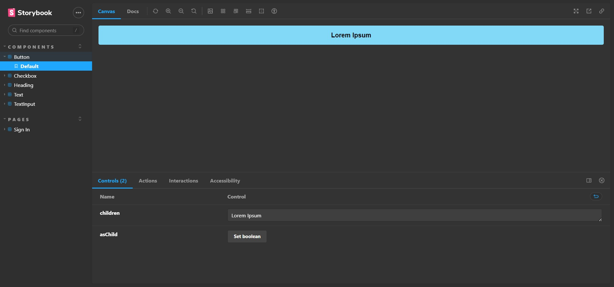

<div align="center">

</div>

</div> -->
<div align="center">

# Ignite Lab - Storybook

</div>


### <div align="center"> Aplicação em Reactjs/Typescript, abordando conceitos sobre: </div>

- [Storybook](https://www.typescriptlang.org/) - Tipagens avançadas
- [Storybook-jest](https://headlessui.com/) - UI para tailwind

## <div align="center">Requisitos</div>

Para executar a aplicação é necessário instalar algumas ferramentas tais como um editor de códigos para realizar compilação dos mesmos. Nesse projeto foi utilizado o [Visual Studio Code](https://code.visualstudio.com/), [NodeJS](https://nodejs.org/en/) para compilação do código, [Git Bash](https://gitforwindows.org/) para baixar o repositório e baixar todas as dependências necessárias.

```bash
# Clone este repositório(caso ja tenha feito isso no passo anterior, pule para o próximo comando)
$ git clone <https://github.com/Ricnaga/ignite-lab-storybook>

# Acesse a pasta do projeto no terminal/cmd
$ cd ignite-lab-storybook

# Instale as dependências
$ yarn (ou npm -i)

# Inicie a aplicação no lado do backend
$ yarn storybook (ou npm run storybook)

# Para executar os teste execute
# Os testes só podem serem executados se o storybook estiver em execução
$ yarn test-storybook ou npm run test-storybook

# Após carregar, no navegador digite <http://localhost:6006>
```

#

## <div align="center">Demonstração</div>

### <div align="center"> [https://ricnaga.github.io/ignite-lab-storybook/](https://ricnaga.github.io/ignite-lab-storybook//)</div>
